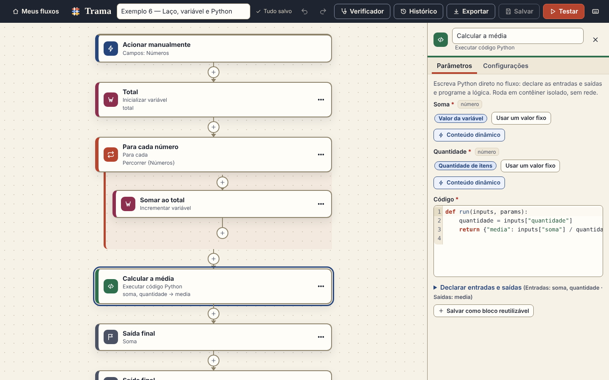
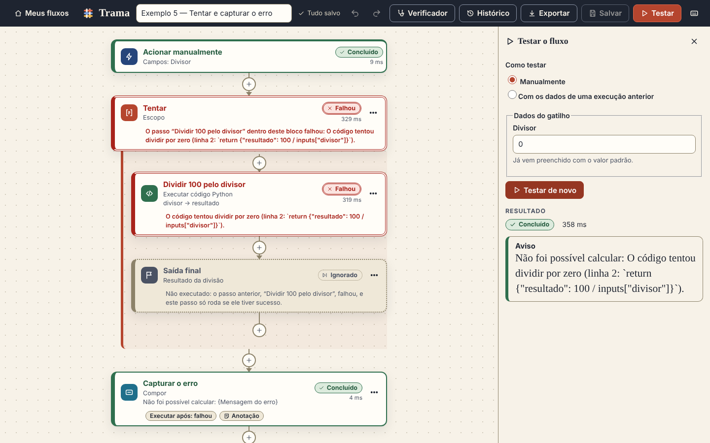

# Trama — automação em passos, com Python quando você precisar

Monte fluxos como no **Power Automate**: um *gatilho* e uma lista de *passos* empilhados, onde cada passo usa o
**conteúdo dinâmico** dos anteriores. A diferença é que, em vez de expressões, você tem **Python de verdade**: um passo
“Executar código Python” dentro do fluxo (ou um bloco Python reutilizável da biblioteca) rodando em um contêiner Docker isolado.


* **Frontend:** React + TypeScript (Vite), CodeMirror para o código. Interface toda em português do Brasil.
* **API:** FastAPI (Python). Toda a lógica de validação e execução fica no backend.
* **Persistência:** SQLite local (`data/trama.db`): projetos, blocos Python, histórico de execuções.
* **Executor:** um contêiner Docker novo e descartável a cada execução de código do usuário.

É um MVP **local e de usuário único** (sem autenticação). Veja [Limitações verificadas](#limitações-verificadas).

---

## Início rápido

Pré-requisitos: **Python 3.11+** (testado com 3.13), **Node.js 18+** (testado com 22) e, para rodar código Python, **Docker**
(o serviço precisa estar ativo e o seu usuário com permissão de usá-lo).

```bash
./scripts/setup.sh     # venv + dependências + build do frontend + imagem do executor
./scripts/start.sh     # inicia em http://127.0.0.1:8000
```

Abra <http://127.0.0.1:8000>. A tela inicial tem uma galeria de **modelos** (os seis exemplos abaixo): “Usar este modelo” cria
um fluxo pronto para testar. Atalhos do `make`: `setup`, `start`, `dev` (API com recarga + Vite em `localhost:5173`), `test`, `e2e`.

> Se o Docker Hub recusar o download da imagem base por limite de requisições, use um espelho:
> `BASE_IMAGE=mirror.gcr.io/library/python:3.12-slim ./scripts/build-executor.sh`

**Sem Docker?** A Trama funciona, mas o código Python fica **desabilitado** — e isso é informado na
interface (aviso no topo, passo marcado no verificador, teste recusado antes de executar). Nunca há
execução “sem isolamento” como alternativa. Os demais passos continuam funcionando.

### Modelos / exemplos (pasta `examples/`)

| Arquivo | O que mostra | Resultado esperado |
|---|---|---|
| `01-saudacao.json` | Gatilho com nome → passo **Python** de saudação → saída | `Olá, Ana!` |
| `02-soma.json` | Dois números do gatilho → operação matemática | `5` |
| `03-condicao.json` | **Condição**: só o caminho escolhido executa, o outro fica **ignorado** | `225` (com `150`: `150`) |
| `04-lista.json` | Transformar cada item de uma lista, com limite | `[30, 60, 90]` |
| `05-tratar-erros.json` | **Tentar e capturar**: escopo que falha + passo “Executar após: falhou” | `Não foi possível calcular: …` (o fluxo termina com sucesso) |
| `06-laco-e-variavel.json` | **Para cada** + variável acumuladora + Python calculando a média | soma `60`, média `20` |

São arquivos de exportação da própria Trama: também dá para usar **Importar fluxo** na tela inicial.
Quem prefere começar com a lista de projetos já preenchida pode iniciar com `TRAMA_SEED_EXAMPLES=1`.

---

## Do Power Automate para a Trama

A Trama copia o *jeito de montar* do Power Automate e troca o que é “expressão” por Python.

| No Power Automate | Na Trama |
|---|---|
| Gatilho + passos empilhados, conectados por “+” | Igual: o **gatilho** (“Acionar manualmente”, com campos que você declara) e os passos, com um botão “+” entre eles |
| Conteúdo dinâmico (as “fichas” coloridas) | Botão **Conteúdo dinâmico** em cada campo: a saída de um passo anterior entra como uma ficha dentro do texto. Uma ficha sozinha **preserva o tipo** (número continua número); misturada com texto, vira texto |
| Condição (*Se sim* / *Se não*) | **Condição** com duas ramificações e regras “e/ou” (igual a, maior que, contém, está vazio…). O ramo não escolhido aparece como **ignorado** |
| Aplicar a cada | **Para cada** (com limite de itens, que falha em vez de cortar a lista em silêncio) e **Repetir até** (com limite de repetições) |
| Escopo + *Configurar execução após* (tentar/capturar/finalmente) | **Escopo** e **Executar após** em cada passo: *teve sucesso, falhou, foi ignorado, expirou*. Uma falha “tratada” por um passo posterior deixa a execução como **sucesso** |
| Política de repetição e tempo limite | Aba **Configurações** do passo: até 5 novas tentativas com intervalo, e tempo limite próprio para código Python |
| Variáveis (inicializar, definir, incrementar, acrescentar) | Os mesmos quatro passos de **Variáveis** (só podem ser criadas na lista principal) |
| Encerrar | **Encerrar** como sucesso, falha ou cancelado |
| Verificador de fluxo | **Verificador**: lista o que falta (campo obrigatório, referência quebrada, tipo errado…), leva ao passo e some quando é corrigido |
| Painel de teste (manual ou com dados de uma execução anterior) | **Testar**: manual, ou reaproveitando os dados de uma execução do histórico |
| Histórico de execuções (somente leitura) | **Histórico**: abre o fluxo **como ele era** na época da execução, com o estado de cada passo e de cada repetição |
| Desfazer / refazer, duplicar e mover passos | Desfazer/refazer (`Ctrl+Z`, `Ctrl+Y`) e menu **⋯** do passo (duplicar, mover, excluir) |
| Modelos | Galeria de modelos na tela inicial |
| **Expressões** (`@{…}`) | **Código Python** — o diferencial da Trama (veja abaixo) |

O que **não** existe (de propósito, para manter o foco): conectores externos, agendamento e outros gatilhos, ramificações
paralelas e *Switch*. Uma condição não tem “paralelo”: os passos rodam **um por vez, de cima para baixo**.

---

## Usando

1. **Novo fluxo** → o editor abre com o gatilho no topo. Clique em **Acionar manualmente** e declare os campos que o fluxo pede
   (texto, número, sim/não, lista ou objeto JSON), com valor padrão.
2. Clique em **+** (entre dois passos) ou em **Novo passo** para escolher um passo. O seletor tem busca e agrupa por categoria
   (Controle, Variáveis, Dados, Texto, Cálculo, Python, Saída, mais os seus blocos).
3. Em cada campo do painel da direita, digite um valor fixo ou clique em **Conteúdo dinâmico** para usar o resultado de um passo
   anterior (ou do gatilho). Só aparece o que está **disponível naquele ponto**: o gatilho, os passos de cima e, dentro de uma
   condição ou laço, o que veio de fora. O que foi criado *dentro* de uma condição ou laço não vale depois dela; o que foi criado dentro de um
   **escopo** vale.
4. **Ctrl+S** salva (rascunhos com campos faltando também podem ser salvos). **Testar** (`Ctrl+Enter`) executa com os dados que você
   informar; cada cartão mostra *Aguardando, Executando, Concluído, Falhou ou Ignorado* (ícone + texto + borda, nunca só cor), com a duração e,
   quando falha, o motivo em linguagem simples e **Detalhes técnicos** expansíveis. Dá para **cancelar** uma execução em andamento.
5. **Exportar** baixa um `.trama.json` (com o código dos blocos Python usados); **Importar fluxo** recria tudo em outra instalação.
   Arquivos exportados pela versão anterior da Trama (grafo de blocos) são **convertidos ao importar**.



### Passos disponíveis

| Categoria | Passos |
|---|---|
| Gatilhos | Acionar manualmente |
| Controle | Condição · Para cada · Repetir até · Escopo · Encerrar |
| Variáveis | Inicializar variável · Definir variável · Incrementar variável · Acrescentar à lista |
| Dados | Compor · Selecionar campos (JSON) · Transformar lista (aceita código Python) |
| Texto / Cálculo | Transformar texto · Operação matemática |
| Python | **Executar código Python** · **seus blocos Python reutilizáveis** |
| Saída | Saída final |

### Tentar e capturar erros



Como no Power Automate, coloque os passos arriscados em um **Escopo** (“Tentar”) e, logo depois, um passo com **Executar após: falhou**
(“Capturar”). O escopo expõe `Algum passo falhou?`, `Mensagem do erro` e `Resultado de cada passo`. *Executar após* olha o passo
**imediatamente anterior** — por isso se usa um escopo para agrupar vários passos. Se nada captura a falha, a execução termina como **falhou**
e os passos seguintes ficam **ignorados**, cada um explicando por quê.

---

## Python: dois jeitos

**1. Passo “Executar código Python” (no próprio fluxo).** Declare as entradas (cada uma recebe um valor fixo ou conteúdo dinâmico) e as saídas,
e escreva a função. Outros passos usam suas saídas como qualquer conteúdo dinâmico. É o equivalente a uma expressão, só que com a linguagem inteira.
Quando o código ficar bom, **Salvar como bloco reutilizável** o leva para a biblioteca.

**2. Bloco Python reutilizável.** Em **Blocos Python** (tela inicial) ou **Criar bloco Python reutilizável** (no seletor de passos): entradas, saídas e
parâmetros com tipo, o código (com destaque de sintaxe) e **teste com dados de exemplo** antes de salvar.


O contrato é o mesmo nos dois:

```python
def run(inputs: dict, params: dict) -> dict:
    nome = inputs.get("nome", "mundo")
    return {"mensagem": f"Olá, {nome}!"}
```

* `inputs`: dados dos campos (entradas opcionais não preenchidas **não aparecem** no dicionário).
* `params`: configuração do bloco (padrões já aplicados) — só nos blocos reutilizáveis.
* O retorno é validado contra o contrato: todas as saídas declaradas, nenhuma extra, tipo certo, JSON puro e dentro do limite de tamanho.
* Tipos: **texto, número, booleano, lista, objeto JSON** (+ *qualquer*, verificado na execução).
* Bibliotecas: **apenas a biblioteca padrão** do Python (math, json, re, datetime, statistics, itertools…).
* Um erro mostra o passo, a mensagem e a **linha** onde parou; `print()` vira log do passo.
* **Versões (blocos reutilizáveis):** cada salvamento de um bloco existente cria uma **nova versão**. O fluxo guarda a versão que usa, não muda sozinho
  e avisa quando há uma mais nova (“Atualizar para v2” é uma escolha explícita).

### Regras de execução

* Os passos rodam **em sequência**, de cima para baixo. Cada execução guarda um *retrato* congelado do fluxo e das definições (versões fixadas).
* **Condição:** só o ramo escolhido executa; o outro (e tudo dentro dele) fica *ignorado*.
* **Repetições:** *Para cada* (limite de itens, padrão 100, máximo 10.000) e *Repetir até* (limite de repetições, máximo 100). Cada repetição de cada passo
  tem a sua linha no histórico; no máximo 5.000 linhas por execução.
* **Falhas:** um passo que falha deixa os seguintes **ignorados**, a menos que algum deles esteja configurado para rodar após a falha (e então a falha é
  considerada tratada). Erros de configuração (campo faltando, tipo errado) nunca são repetidos; falhas do código ou do tempo limite podem ser (política de repetição do passo).
* Limites do fluxo: 200 passos e 8 níveis de aninhamento.

---

## Execução segura de Python

O código personalizado é tratado como **não confiável**. A API **nunca** o executa no próprio processo: ela chama o Docker e
entrega o trabalho por `stdin`. Cada execução é um contêiner novo com:

| Controle | Como |
|---|---|
| Usuário sem privilégios | `--user 65534:65534` (nobody) + `--cap-drop ALL` + `no-new-privileges` + seccomp padrão |
| Sem rede | `--network none` (o teste confirma que só existe a interface `lo`) |
| Sistema de arquivos restrito | `--read-only` + um único tmpfs de 16 MB em `/tmp` (sem `exec`); sem volumes, sem credenciais, sem o socket do Docker |
| Memória / CPU / processos | `--memory` (sem swap) + `RLIMIT_AS`, `--cpus`, `--pids-limit`, `ulimit` de CPU/arquivos |
| Tempo | limite brando dentro do runner (mostra a **linha** onde parou e preserva os logs; re-armado a cada 250 ms) + abate forçado pelo host com `docker kill` + **vigia dentro do contêiner** (`timeout` como PID 1, que o código não consegue encerrar e que mata tudo se a API morrer) + limite de tempo de CPU |
| Volume de saída e de dados | teto de logs, de resultado e de entrada; excesso → encerra com erro claro |
| Resposta do runner | tratada como **não confiável**: o código do usuário roda no mesmo processo do runner e consegue forjá-la, então o host só aceita tipos, categorias e tamanhos conhecidos (logs truncados no limite, linha/trecho como número/texto) |
| Erros | traduzidos para português; segredos conhecidos mascarados nos logs; `OOMKilled` distingue falta de memória de outros encerramentos |
| Disco do host | `--log-driver none` (a saída não é duplicada no log do daemon) e `--pull never` |

A lista de bibliotecas permitidas dentro do runner é **só conveniência** (mensagem amigável); os testes contornam esse filtro de
propósito para provar que o que protege é o contêiner. O processo da API precisa de acesso ao Docker — isso equivale a privilégio
elevado no computador. Veja as limitações abaixo.

O **conteúdo dinâmico nunca executa nada**: é só uma referência (`passo`, `saída`, `caminho`) resolvida pelo motor, que lê chaves de objetos e
posições de listas e não alcança atributos do Python. Isso é coberto por teste.

Os **passos internos** rodam no processo da API (código nosso), então também têm teto: o tamanho do resultado é conferido *antes* de montá-lo
(substituir texto, adicionar texto a listas, selecionar campos, montar texto com fichas), parâmetros de texto até 100.000 caracteres, JSON digitado até 1 MB, no máximo
50 campos por passo de seleção. O serviço local ainda recusa `Host` desconhecido, origem diferente, corpo sem `Content-Length`/`Content-Type` JSON, e envia
`X-Frame-Options`, `nosniff` e uma Content-Security-Policy restritiva.

---

## Arquitetura

```
 navegador ── React ──► FastAPI ──► SQLite (data/trama.db)
                          │
                          ├─ motor (valida, executa os passos em sequência; passos internos no processo da API)
                          └─ DockerExecutor ──► contêiner "trama-executor" (runner.py + stdlib)
```

```
backend/app/   models (formato v2), passos (percorrer a árvore), validation (verificador), migracao (v1→v2),
               engine (fachada do motor: iniciar, preparar, rodar, cancelar) e os módulos dele: preparo, execucao,
               historico (única porta de escrita do histórico), despacho, controle (condição, laços, escopo),
               passos_simples, dinamico, erros_sandbox, teste_bloco;
               store (SQLite), exchange (export/import), custom_blocks, blocks/builtin.py (passos internos),
               sandbox/executor.py (Docker), api.py, main.py
executor/      Dockerfile + runner.py (roda DENTRO do contêiner)
frontend/src/  components/ (Designer, PainelPasso, CampoDinamico, Verificador, PainelTeste, Historico…; EditorPage só compõe),
               hooks/ (estado com efeitos do editor: useProjeto, useCatalogo, useExecucao, useVisaoDeExecucao, useAtalhos,
               useHistorico), lib/ (lógica pura, testada sem DOM: modelo, rascunho, execucao, acompanhamento, catalogo, atalhos),
               styles/theme.css
examples/      modelos de fluxo      scripts/      setup, start, build do executor
```

O fluxo é um JSON (chaves em inglês, valores em português) — trecho do exemplo 2:

```json
{ "schema_version": 2,
  "trigger": { "id": "gatilho", "type": "builtin.gatilho_manual", "version": 1,
               "params": { "campos": [{ "id": "a", "label": "Primeiro número", "type": "numero", "default": 2 },
                                      { "id": "b", "label": "Segundo número",  "type": "numero", "default": 3 }] } },
  "steps": [
    { "id": "soma", "type": "builtin.matematica", "version": 1, "label": "Somar",
      "inputs": { "a": { "parts": [{ "step": "gatilho", "output": "a", "path": "" }] },
                  "b": { "parts": [{ "step": "gatilho", "output": "b", "path": "" }] } },
      "params": { "operacao": "somar" }, "run_after": ["sucesso"] } ] }
```

Cada campo de um passo é um valor fixo (`{"value": …}`) ou uma lista de pedaços (`{"parts": [...]}`) de texto e referências. Passos com
ramificações ou corpo (`condicao`, `para_cada`, `escopo`…) guardam os filhos em `slots`. O histórico guarda, por execução e por passo (e por repetição):
entradas, saídas, logs, erro, estado e tempos.

### Banco e migração

O banco usa o esquema 2 (`PRAGMA user_version`). Se a Trama abrir um banco da versão anterior (grafo de blocos), ela **converte os projetos
automaticamente** e deixa uma cópia `trama.db.v1.bak` ao lado. A conversão mantém o comportamento: o *Início manual* vira o gatilho com um campo `dados`,
valores constantes viram *Compor*, condições viram *Condição* com os blocos de cada caminho dentro do ramo, e *Para cada* vira *Transformar lista*.
O histórico de execuções antigas **não é convertido** (ele descrevia blocos que não existem mais): fica só na cópia `.v1.bak`. A importação de arquivos antigos usa o mesmo conversor.

### Configuração (variáveis de ambiente)

| Variável | Padrão | |
|---|---|---|
| `TRAMA_DATA_DIR` | `./data` | onde fica o banco SQLite |
| `TRAMA_EXECUTOR_IMAGE` | `trama-executor:2` | imagem do executor |
| `TRAMA_TIMEOUT_S` / `TRAMA_MEMORY_MB` / `TRAMA_CPUS` / `TRAMA_PIDS` | `10` / `256` / `1` / `64` | limites do código Python |
| `TRAMA_LOGS_KB` / `TRAMA_VALUE_KB` / `TRAMA_MAX_LIST_ITEMS` | `64` / `1024` / `10000` | volume de logs, tamanho de cada valor, itens por lista |
| `TRAMA_HOST` / `TRAMA_PORT` | `127.0.0.1` / `8000` | só local por padrão (não há autenticação) |
| `TRAMA_ALLOWED_HOSTS` / `TRAMA_ALLOWED_ORIGINS` | localhost… / vazio | proteção contra requisições de outros sites |
| `TRAMA_SEED_EXAMPLES` | `0` | `1` cria os exemplos como projetos se o banco estiver vazio (a galeria de modelos aparece de qualquer jeito) |
| `TRAMA_DOCS` | desligado | `1` liga a documentação interativa da API em `/api/docs` |

---

## Testes

```bash
make test-backend    # 280 testes (pytest). Os que usam Docker são PULADOS, com o motivo, se ele não estiver disponível
make test-frontend   # typecheck + 20 testes unitários (vitest) das operações sobre o fluxo
make e2e             # 27 testes no navegador (Playwright) + verificação automática de acessibilidade (axe, WCAG 2.1 AA)
                     # 1ª vez: `cd frontend && npx playwright install chromium` (ou PLAYWRIGHT_CHROMIUM_PATH=/caminho/do/chrome)
```

### Comportamentos principais → onde são provados

| # | Comportamento | Testes |
|---|---|---|
| 1 | Criar, salvar, fechar e reabrir preserva passos, parâmetros e conteúdo dinâmico (e rascunhos incompletos podem ser salvos) | `test_api.py::test_criar_salvar_fechar_e_reabrir_*`, `test_rascunho_*`; e2e `criar do zero → … → reabrir → testar` |
| 2 | Gatilho → passo Python de saudação → saída | `test_python_flows.py::test_gatilho_python_saida_com_o_codigo_do_enunciado`; `test_modelos_com_python_*` |
| 3 | Soma de dois números do gatilho | `test_engine.py::test_dois_numeros_do_gatilho_e_uma_soma` |
| 4 | Condição executa só o ramo certo; o outro fica ignorado | `test_engine.py::test_condicao_*`; e2e `condição: só o caminho escolhido executa…` |
| 5 | Lista transformada dentro do limite, e falha (sem cortar) acima dele | `test_engine.py::test_transforma_todos_os_itens_*`, `test_acima_do_limite_*` |
| 6 | Campos faltando, tipos incompatíveis e referências a passos que ainda não rodaram são apontados *antes* de executar | `test_validation.py`, `test_engine.py::test_fluxo_invalido_e_rejeitado_*`; e2e `o verificador de fluxo aponta o que falta…` |
| 7 | Exceção em Python identifica o passo, o erro e a linha | `test_python_flows.py::test_excecao_identifica_o_passo_o_erro_e_a_linha`; e2e `passo de código Python…` |
| 8 | Laço infinito é encerrado pelo limite de tempo | `test_executor.py` (brando **e** abate pelo host), `test_python_flows.py::test_laco_infinito_*`; e2e `código com laço infinito…` |
| 9 | Bloco salvo é reutilizado em outro fluxo; editar cria versão e o fluxo continua na versão fixada | `test_python_flows.py::test_bloco_salvo_e_reutilizado_*`, `test_versao_fixada_*`; e2e `editar um bloco cria nova versão…` |
| 10 | Exportar/importar preserva o comportamento (em uma instalação vazia) | `test_api.py::test_exportar_e_importar_*`; e2e `exportar e importar…` |
| 11 | Tentar e capturar: falha tratada deixa a execução como sucesso; falha sem tratamento, como falhou | `test_engine.py::test_passo_com_executar_apos_falhou_*`, `test_escopo_que_falha_*`; e2e `tentar e capturar…` |
| 12 | Fluxos e bancos da versão anterior são convertidos mantendo o resultado dos quatro exemplos originais | `test_migracao.py` (com arquivos reais em `tests/fixtures/v1/`); e2e `arquivo exportado pela versão anterior…` |
| 13 | O histórico abre o fluxo **da época**, somente leitura | `test_api.py::test_a_execucao_guarda_o_fluxo_da_epoca_*`; e2e `histórico: abrir uma execução antiga…` |

O isolamento é verificado **de dentro do contêiner**: usuário 65534, rootfs somente leitura (inclusive `/var/tmp`), só a interface `lo`,
capacidades zeradas, `NoNewPrivs`, seccomp ativo, limites de memória/pids/CPU lidos do cgroup, bomba de processos contida, sem
variáveis de ambiente nem arquivos do host, estado não compartilhado entre execuções, logs/saída excessivos, e a recusa sem Docker.
Para o executor também foi feita uma checagem de mutação: remover `--network none`, `--read-only` ou o limite de memória faz algum teste falhar.

---

## Revisão independente de segurança

Um revisor independente (sem acesso às minhas conclusões) tentou provar falhas no executor, no motor, na importação e no frontend da versão
anterior. Ele **não achou** nenhum caminho que execute código do usuário fora do contêiner, nem com o Docker ausente. Achou e provou falhas em outras
partes, todas corrigidas e cobertas por teste de regressão (`backend/tests/test_revisao.py`, `test_executor.py`, `frontend/e2e/revisao.spec.ts`): passos internos que
amplificavam dados antes do teto de tamanho, runner com resposta forjável pelo código do usuário, contêiner órfão se a API morresse, texto com U+2028
derrubando o passo, parâmetros muito aninhados que gravavam e depois não abriam, erros 500 em entradas inesperadas, edição simultânea de blocos,
importação que poluía a biblioteca, perda silenciosa de dados ao fechar o editor de bloco ou ao reeditar um bloco importado, e uma tela que ficava em branco com
dados malformados. Os mesmos testes foram portados para o formato em passos (a suíte de segurança continua cobrindo o conteúdo dinâmico, o aninhamento e o histórico), mas
**a nova camada de passos/conteúdo dinâmico ainda não passou por uma revisão independente própria.**

---

## Limitações verificadas

**Segurança e operação**
* **Um usuário, sem autenticação.** Ouve só em `127.0.0.1`. Antes de expor a vários usuários é preciso autenticação e autorização
  para projetos, blocos e execuções (hoje há só proteção contra requisições de outros sites: host/origem/`Content-Type`).
* **O acesso ao Docker é privilegiado** (grupo `docker` ≈ root no host). Contêiner ≠ máquina virtual: compartilha o kernel. Para código de
  terceiros realmente hostil, rode a API em um host dedicado e considere gVisor/Kata/Firecracker ou Docker rootless.
* Testado em **Linux, Docker Engine 29, cgroup v1** (os testes de cgroup também leem o caminho do v2, mas só o v1 foi exercitado).
  **Não testado** em macOS/Windows (Docker Desktop), Podman ou Docker rootless.
* Cada execução de código Python inicia um contêiner (**≈1 s de sobrecarga**). Um fluxo com N passos Python paga N inícios; um passo Python dentro de um
  *Para cada* paga um início **por item**. No máximo 4 contêineres rodam em paralelo.
* A **tentativa de cancelar** interrompe o fluxo entre passos (e a espera entre tentativas); um código Python já em andamento termina ou estoura o limite de tempo.
  Se o servidor reiniciar no meio, as execuções ficam marcadas como falha. Rode **um único processo** do servidor.
* O histórico de execuções **não tem política de retenção** (cresce até o projeto ser excluído).
* Dentro do contêiner ainda são legíveis metadados do host sem segredos (`/proc/version`, `/proc/meminfo`, `mountinfo`, `/etc/resolv.conf`); como não há rede, não há o que fazer com eles.
* Se a API morrer no meio de uma execução, o vigia encerra o contêiner em até ≈ (limite de tempo + folga + 5) s; contêineres que sobrarem são removidos na próxima inicialização.
* **Inteiros acima de 2^53** (≈ 9×10^15) perdem precisão quando passam pelo navegador (limite do JSON do JavaScript). O backend e o Python os preservam; use texto para identificadores longos.

**Produto**
* **Sem integrações externas** (conectores), **agendamento ou outros gatilhos** (só “Acionar manualmente”), **ramificações paralelas** nem *Switch*; sem instalação
  de bibliotecas (rede desligada e só a biblioteca padrão).
* Os passos rodam **um por vez**. *Executar após* considera apenas o passo imediatamente anterior (use um **Escopo** para agrupar).
* Variáveis só podem ser criadas na lista principal (não dentro de condições, laços ou escopos), como no Power Automate.
* O que é criado dentro de uma condição ou de um laço **não fica disponível depois dele**; para usar um resultado fora, guarde-o em uma variável.
* O gatilho tem campos tipados que você declara (nada de formulários ou esquemas JSON do Power Automate).
* Duplicar copia passos no mesmo fluxo (não entre fluxos). Desfazer/refazer vale para a sessão de edição aberta. O aviso de “alterações não salvas” cobre fechar/recarregar
  e o botão *Meus fluxos*, não o botão Voltar do navegador. Salvamento é manual; salvar em duas abas dá erro de conflito de revisão (nada é sobrescrito).
* No editor de código, `Esc` não fecha o diálogo (ativa o modo “Tab move o foco” do CodeMirror): use `Esc` e depois `Tab`.
* Limites de tamanho: 200 passos e 8 níveis de aninhamento por fluxo; 1 MB por valor trafegado; 64 KB de logs.
* O editor foi verificado por testes automáticos e por uma checagem de acessibilidade (axe), mas **não** passou por teste com leitor de tela real nem por
  teste de usabilidade com pessoas.

---

## Identidade visual

“Trama” evoca tecelagem: papel cru, tinta, terracota, anil e açafrão; a marca são fios tecidos. As categorias de passos têm cores próprias, sempre acompanhadas de
ícone e nome. Todos os pares de cor de texto passam em WCAG AA (≥ 4,5:1) e as bordas de controles em ≥ 3:1 (conferidos por script e pelo axe).
Respeita `prefers-reduced-motion` e `forced-colors`.
