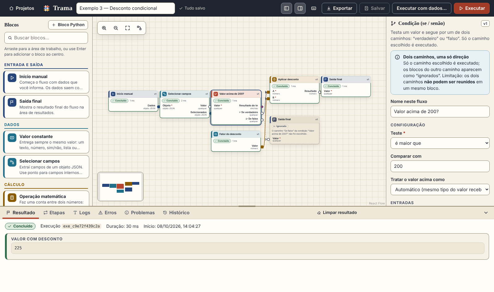
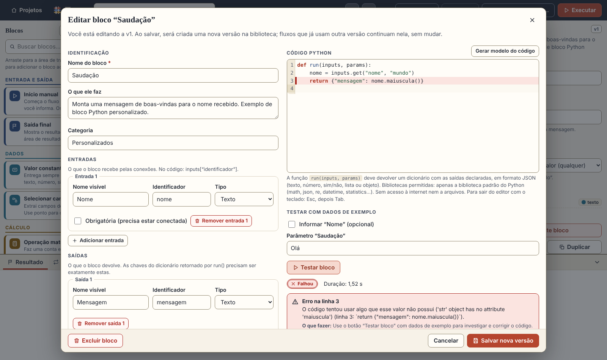

# Trama — programação visual e automação em Python

Monte fluxos arrastando blocos e ligando entradas a saídas, no estilo do Power Automate, e escreva
Python quando precisar. O código Python **roda de verdade**, dentro de um contêiner Docker isolado.



* **Frontend:** React + TypeScript + React Flow (Vite). Interface toda em português do Brasil.
* **API:** FastAPI (Python). Toda a lógica de validação e execução fica no backend.
* **Persistência:** SQLite local (`data/trama.db`): projetos, blocos personalizados, histórico.
* **Executor:** um contêiner Docker novo e descartável a cada execução de código do usuário.

É um MVP **local e de usuário único** (sem autenticação). Veja [Limitações verificadas](#limitações-verificadas).

---

## Início rápido

Pré-requisitos: **Python 3.11+** (testado com 3.13), **Node.js 18+** (testado com 22) e, para rodar código Python, **Docker**
(o serviço precisa estar ativo e o seu usuário com permissão de usá-lo).

```bash
./scripts/setup.sh     # venv + dependências + build do frontend + imagem do executor
./scripts/start.sh     # inicia em http://127.0.0.1:8000
```

Abra <http://127.0.0.1:8000>. Na primeira execução, quatro projetos de exemplo são criados.
Atalhos: `make setup`, `make start`, `make dev` (API com recarga + Vite em `localhost:5173`), `make test`, `make e2e`.

> Se o Docker Hub recusar o download da imagem base por limite de requisições, use um espelho:
> `BASE_IMAGE=mirror.gcr.io/library/python:3.12-slim ./scripts/build-executor.sh`

**Sem Docker?** A Trama funciona, mas o código Python fica **desabilitado** — e isso é informado na
interface (aviso no topo, botão de teste desabilitado, fluxo recusado antes de executar). Nunca há
execução "sem isolamento" como alternativa. Blocos internos continuam funcionando.

### Exemplos (pasta `examples/`)

| Arquivo | O que mostra | Resultado esperado |
|---|---|---|
| `01-saudacao.json` | Início com nome → seleção do campo → **bloco Python** de saudação → saída | `Olá, Ana!` |
| `02-soma.json` | Dois valores constantes + operação de soma | `5` |
| `03-condicao.json` | Condição: só um caminho executa, o outro fica **ignorado** | `225` (com `{"valor": 150}`: `150`) |
| `04-lista.json` | Transformação de cada item de uma lista, com limite | `[30, 60, 90]` |

São arquivos de exportação da própria Trama: use **Importar fluxo** na tela inicial.

---

## Usando

1. **Novo projeto** → o editor abre com a biblioteca à esquerda, a área de trabalho no centro e a
   configuração à direita. Embaixo ficam **Resultado, Etapas, Logs, Erros, Problemas e Histórico**.
2. Arraste blocos para a área de trabalho (ou use `Enter` sobre o item da biblioteca).
3. Ligue uma **saída** (direita do bloco) a uma **entrada** (esquerda). Cada porta tem **cor + forma + nome do
   tipo**. Conexões inválidas (ciclo, tipos incompatíveis, junção de caminhos de uma condição) são recusadas na hora, com a explicação;
   ligar a uma entrada que já tem conexão **substitui** a anterior (o servidor recusa fluxos com duas conexões na mesma entrada).
   Prefere o teclado? No painel da direita, cada entrada tem um seletor "ligar a…".
4. Configure o bloco selecionado no painel. **Ctrl+S** salva; **Ctrl+Enter** executa; **Executar com dados…** substitui os dados do
   bloco *Início manual* só naquela execução.
5. Acompanhe: o bloco em execução fica destacado; cada bloco mostra *Aguardando, Executando, Concluído, Falhou ou Ignorado*
   (ícone + texto + estilo de borda, nunca só cor). Erros vêm em linguagem simples, com **Detalhes técnicos** expansíveis.
6. **Exportar** baixa um `.trama.json` (com o código dos blocos Python usados); **Importar fluxo** recria tudo em outra instalação.



### Biblioteca inicial

Início manual · Valor constante · Operação matemática · Transformar texto · Selecionar campos (JSON) ·
Condição (se/senão) · Para cada item da lista (com limite; aceita código Python) · **Blocos Python personalizados** · Saída final.

### Bloco Python personalizado

Em **+ Bloco Python** você declara entradas, saídas e parâmetros (com tipo), escreve o código (editor com destaque de sintaxe),
**testa com dados de exemplo** e salva na biblioteca. Contrato:

```python
def run(inputs: dict, params: dict) -> dict:
    nome = inputs.get("nome", "mundo")
    return {"mensagem": f"Olá, {nome}!"}
```

* `inputs`: dados das conexões (entradas opcionais não ligadas **não aparecem** no dicionário).
* `params`: configuração do bloco (padrões já aplicados).
* O retorno é validado contra o contrato: todas as saídas declaradas, nenhuma extra, tipo certo, JSON puro e dentro do limite de tamanho.
* Tipos: **texto, número, booleano, lista, objeto JSON** (+ *qualquer*, verificado na execução).
* Bibliotecas: **apenas a biblioteca padrão** do Python (math, json, re, datetime, statistics, itertools…).
* **Versões:** cada salvamento de um bloco existente cria uma **nova versão**. O fluxo guarda a versão que usa, não muda sozinho
  e avisa quando há uma mais nova ("Atualizar para v2" é uma escolha explícita).

### Regras do fluxo (MVP)

* Só grafos **sem ciclos**; a ordem de execução vem das dependências, não da posição na tela.
* **Condição:** só o caminho escolhido executa; os blocos do outro caminho (e os que dependem deles) ficam *ignorados*.
  **Limitação desta versão** (explicada na interface): não é possível reunir caminhos de uma condição em um mesmo bloco.
* **Repetição:** só dentro do bloco *Para cada item*, com limite de itens (se a lista passar do limite, o bloco falha em vez de cortar em silêncio).
* O fluxo **para na primeira falha**; o diagnóstico de cada bloco (entradas, saídas, logs, erro) é preservado.

---

## Execução segura de Python

O código personalizado é tratado como **não confiável**. A API **nunca** o executa no próprio processo: ela chama o Docker e
entrega o trabalho por `stdin`. Cada execução é um contêiner novo com:

| Controle | Como |
|---|---|
| Usuário sem privilégios | `--user 65534:65534` (nobody) + `--cap-drop ALL` + `no-new-privileges` + seccomp padrão |
| Sem rede | `--network none` (o teste confirma que só existe a interface `lo`) |
| Sistema de arquivos restrito | `--read-only` + um único tmpfs de 16 MB em `/tmp` (sem `exec`); sem volumes, sem credenciais, sem o socket do Docker |
| Memória / CPU / processos | `--memory` (sem swap) + `RLIMIT_AS`, `--cpus`, `--pids-limit`, `ulimit` de CPU/arquivos |
| Tempo | limite brando dentro do runner (mostra a **linha** onde parou e preserva os logs) + abate forçado pelo host com `docker kill` |
| Volume de saída e de dados | teto de logs, de resultado e de entrada; excesso → encerra com erro claro |
| Erros | traduzidos para português; segredos conhecidos mascarados nos logs |

A lista de bibliotecas permitidas dentro do runner é **só conveniência** (mensagem amigável); os testes contornam esse filtro de
propósito para provar que o que protege é o contêiner. O processo da API precisa de acesso ao Docker — isso equivale a privilégio
elevado no computador. Veja as limitações abaixo.

---

## Arquitetura

```
 navegador ── React Flow ──► FastAPI ──► SQLite (data/trama.db)
                               │
                               ├─ motor (valida, ordena, executa blocos internos no processo da API)
                               └─ DockerExecutor ──► contêiner "trama-executor" (runner.py + stdlib)
```

```
backend/app/   models, tipos, validation (grafo/tipos/ciclos), engine, store (SQLite), exchange (export/import),
               custom_blocks, blocks/builtin.py (blocos internos), sandbox/executor.py (Docker), api.py, main.py
executor/      Dockerfile + runner.py (roda DENTRO do contêiner)
frontend/src/  components/ (editor, painéis, diálogos), lib/flow.ts (conversões), styles/theme.css
examples/      fluxos de exemplo     scripts/      setup, start, build do executor
```

O fluxo é um JSON (chaves em inglês, valores em português) — trecho:

```json
{ "schema_version": 1,
  "blocks": [{ "id": "blk_1", "type": "builtin.constante", "version": 1,
               "position": {"x": 0, "y": 0}, "params": {"tipo": "numero", "valor": 2}, "label": null }],
  "connections": [{ "id": "con_1", "source": {"block": "blk_1", "port": "valor"},
                    "target": {"block": "blk_3", "port": "a"} }] }
```

Cada execução guarda um *snapshot* congelado do fluxo e das definições (versões fixadas), com estado, horários, duração e resultado,
e por bloco: entradas, saídas, logs e erro.

### Configuração (variáveis de ambiente)

| Variável | Padrão | |
|---|---|---|
| `TRAMA_DATA_DIR` | `./data` | onde fica o banco SQLite |
| `TRAMA_EXECUTOR_IMAGE` | `trama-executor:1` | imagem do executor |
| `TRAMA_TIMEOUT_S` / `TRAMA_MEMORY_MB` / `TRAMA_CPUS` / `TRAMA_PIDS` | `10` / `256` / `1` / `64` | limites do código Python |
| `TRAMA_LOGS_KB` / `TRAMA_VALUE_KB` / `TRAMA_MAX_LIST_ITEMS` | `64` / `1024` / `10000` | volume de logs, tamanho de cada valor, itens por lista |
| `TRAMA_HOST` / `TRAMA_PORT` | `127.0.0.1` / `8000` | só local por padrão (não há autenticação) |
| `TRAMA_ALLOWED_HOSTS` / `TRAMA_ALLOWED_ORIGINS` | localhost… / vazio | proteção contra requisições de outros sites |
| `TRAMA_SEED_EXAMPLES` | `1` | cria os exemplos se o banco estiver vazio |
| `TRAMA_DOCS` | desligado | `1` liga a documentação interativa da API em `/api/docs` |

---

## Testes

```bash
make test-backend    # 147 testes (pytest). Os que usam Docker são PULADOS, com o motivo, se ele não estiver disponível
make test-frontend   # typecheck + testes unitários (vitest)
make e2e             # 13 testes no navegador (Playwright) + verificação automática de acessibilidade (axe, WCAG 2.1 AA)
                     # 1ª vez: `cd frontend && npx playwright install chromium` (ou PLAYWRIGHT_CHROMIUM_PATH=/caminho/do/chrome)
```

### Critérios de aceite → onde são provados

| # | Critério | Testes |
|---|---|---|
| 1 | Criar, salvar, fechar e reabrir preserva tudo | `test_api.py::test_criterio_1_*`; e2e `criar → arrastar → conectar → salvar → reabrir → executar` |
| 2 | Início → Python de saudação → saída | `test_python_flows.py::test_criterio_2_*`; exemplo 1 em `test_api.py` |
| 3 | Duas constantes + soma | `test_engine.py::test_criterio_3_*` |
| 4 | Condição executa só o caminho certo | `test_engine.py::test_criterio_4_*`; e2e `condição` |
| 5 | Lista transformada dentro do limite | `test_engine.py::test_criterio_5_*` |
| 6 | Tipos incompatíveis, campos obrigatórios e ciclos rejeitados antes | `test_validation.py`, `test_engine.py::test_criterio_6_*`; e2e `rejeita ciclo e tipos…` |
| 7 | Exceção identifica bloco, erro e linha | `test_python_flows.py::test_criterio_7_*`; e2e `criar bloco Python…` |
| 8 | Laço infinito encerrado pelo limite | `test_executor.py` (brando **e** abate pelo host), `test_python_flows.py::test_criterio_8_*`; e2e `laço infinito` |
| 9 | Bloco salvo reutilizado em outro fluxo | `test_python_flows.py::test_criterio_9_*`, `test_versao_fixada_*`; e2e `editar um bloco cria nova versão…` |
| 10 | Exportar/importar preserva o comportamento | `test_api.py::test_criterio_10_*` (em uma segunda instalação vazia); e2e `exportar e importar…` |

O isolamento é verificado **de dentro do contêiner**: usuário 65534, rootfs somente leitura (inclusive `/var/tmp`), só a interface `lo`,
capacidades zeradas, `NoNewPrivs`, seccomp ativo, limites de memória/pids/CPU lidos do cgroup, bomba de processos contida, sem
variáveis de ambiente nem arquivos do host, estado não compartilhado entre execuções, logs/saída excessivos, e a recusa sem Docker.
Também foi feita uma checagem de mutação: remover `--network none`, `--read-only`, o limite de memória, a detecção de ciclos,
a marcação como *ignorados* dos blocos do caminho não escolhido etc. faz algum teste falhar.

---

## Limitações verificadas

**Segurança e operação**
* **Um usuário, sem autenticação.** Ouve só em `127.0.0.1`. Antes de expor a vários usuários é preciso autenticação e autorização
  para projetos, blocos e execuções (hoje há só proteção contra requisições de outros sites: host/origem/`Content-Type`).
* **O acesso ao Docker é privilegiado** (grupo `docker` ≈ root no host). Contêiner ≠ máquina virtual: compartilha o kernel. Para código de
  terceiros realmente hostil, rode a API em um host dedicado e considere gVisor/Kata/Firecracker ou Docker rootless.
* Testado em **Linux, Docker Engine 29, cgroup v1** (os testes de cgroup também leem o caminho do v2, mas só o v1 foi exercitado).
  **Não testado** em macOS/Windows (Docker Desktop), Podman ou Docker rootless.
* Cada execução de código Python inicia um contêiner (**≈1 s de sobrecarga**). Um fluxo com N blocos Python paga N inícios.
  No máximo 4 contêineres rodam em paralelo.
* Execuções não podem ser **canceladas** pelo usuário (terminam, falham ou estouram o limite); se o servidor reiniciar no meio, ficam
  marcadas como falha. Rode **um único processo** do servidor.
* O histórico de execuções **não tem política de retenção** (cresce até o projeto ser excluído).

**Produto**
* Apenas grafos sem ciclos; condições **não reúnem caminhos**; repetição só dentro de *Para cada item* (limite padrão 100, máximo 10.000).
* O *Início manual* tem uma única saída JSON (use *Selecionar campos* para extrair valores); não há portas dinâmicas.
* Sem integrações externas, agendamento ou instalação de bibliotecas (rede desligada e só a biblioteca padrão).
* Sem desfazer/refazer. Duplicar copia blocos no mesmo projeto (não entre projetos). O aviso de "alterações não salvas" cobre fechar/recarregar
  e o botão *Projetos*, não o botão Voltar do navegador. Salvamento é manual; salvar em duas abas dá erro de conflito de revisão (nada é sobrescrito).
* No editor de código, `Esc` não fecha o diálogo (ativa o modo "Tab move o foco" do CodeMirror): use `Esc` e depois `Tab`.
* Limites de tamanho: 200 blocos e 600 conexões por fluxo; 1 MB por valor trafegado; 64 KB de logs.

---

## Identidade visual

"Trama" evoca tecelagem: papel cru, tinta, terracota, anil e açafrão; a marca são fios tecidos. Todos os pares de cor de texto passam em
WCAG AA (≥ 4,5:1) e as bordas de controles em ≥ 3:1 (conferidos por script e pelo axe). Respeita `prefers-reduced-motion` e `forced-colors`.
